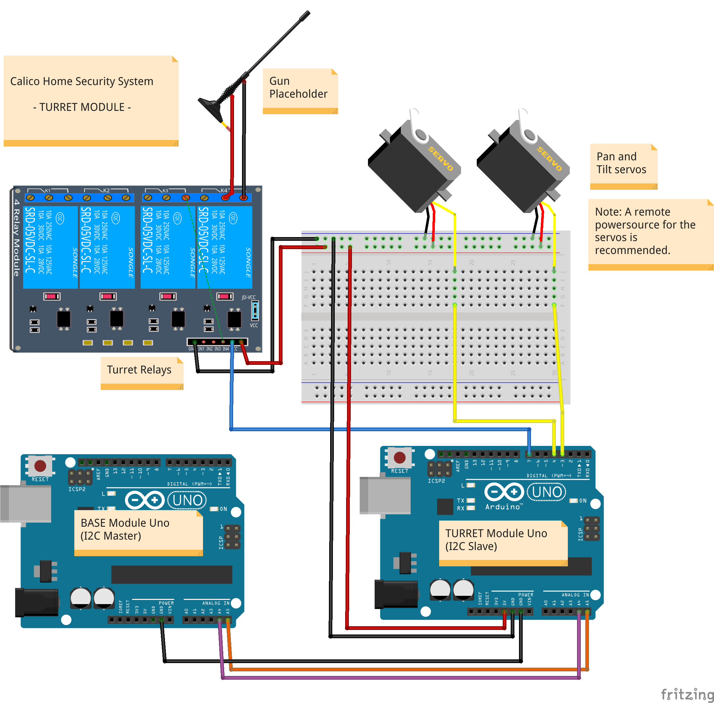

The TURRET Module
=================

The TURRET Module allows the Calico Home Security System to **fight back**! The TURRET Module adds a _fully-automated_ gun (airsoft) turret. Because of the complexities of controlling a fully-automated gun turret, an additional dedicated Arduino Uno is used to control the functionality of the turret. The Base Module's Arduino Uno communicates with the Turret's Arduino Uno through a protocol called I2C.

Parts
-----
* Additional Arduino Uno
* 2x Servos
* [4-Relay Module](https://www.amazon.com/Elegoo-Channel-Optocoupler-Arduino-Raspberry/dp/B01HEQF5HU/ref=sr_1_4?ie=UTF8&qid=1492560612&sr=8-4&keywords=4-relay+module)

Bread Board Diagram
-------------------

(_The TURRET Module Wiring Diagram for the Calico Home Security System_)

Schematic Diagram
-----------------

(_The TURRET Module Wiring Diagram for the Calico Home Security System_)

I2C Protocol
------------
I2C stands for Inter-Integrated Circuit. Many details can be read online to learn about I2C in great detail. Some example links are [Wikipedia](https://en.wikipedia.org/wiki/I%C2%B2C) and [Sparkfun](https://learn.sparkfun.com/tutorials/i2c). The bare minimum you need to know is that this is a standard protocol created in order to allow low-power, low-speed communication between two microcontrollers.

Setup
=====

The Slave Arduino needs to have the contents of the `TurretSLAVE.cpp` file loaded onto it. There are multiple ways to do this. The easiest is to open that file in PlatformIO, copy the entire contents, paste them over top `main.cpp`, the deploy it to the Slave Arduino.

See It In Action
================

Take a look at the Turret Module doing a very basic sweep attack after the alarm has been triggered: https://youtu.be/5av2dN1TxHc
